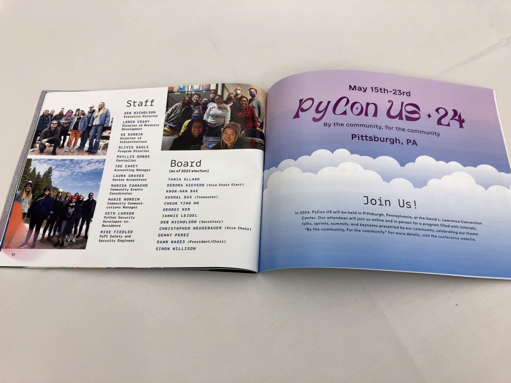
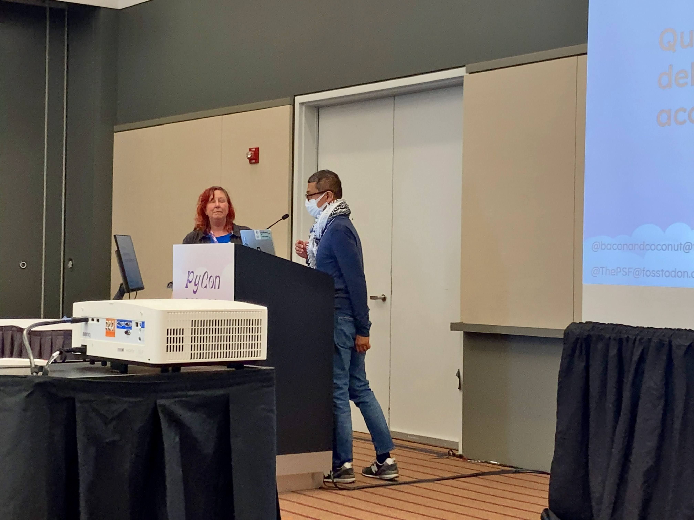

# Day 2

## D&I Panel

* <https://us.pycon.org/2024/about/keynote-speakers/#dei-panel>
* Dima:2019にはじめてインドネシアでボランティア
* アビゲイルにはじめてDjango Girlsをガーナで開催。PyLadiesガーナを立ち上げ
* PyTxasは2007から開始。

* チャレンジは?
* アビゲイル: コミュニティをはじめるのは大変。メンバーに価値があるか耳を傾ける。リソースが問題。
* Dima: 最初は一人だった。人、スポンサー、お金を探した。PSFのGrantでお金を送ってくれた。Pythonコミュニティでのサポートがあった
* ブラジル: COVID-19でいくつかのグループが分かれた。安全な場所を作った

## Keynote: Simon Willison

* <https://us.pycon.org/2024/about/keynote-speakers/#simon-willison>
* LLMについて話したい
* AIじゃなくてImitation intelligence
* どのモデルを使うのがいい?→ふんいき
* MLCChatがおすすめ
* llm.datasette.io
* <https://pypi.org/project/vosk/>
* 以前は考えられないようにプロジェクトを素早く作成できるのを助けてくれる
* PSFの投票ページをDatasetteのプロジェクトでデータセットにする?

```{admonition} 挑戦と反省：はじめてのPyCon US 2024登壇で得たもの

こんにちは、福田 隼也（@JunyaFff）です。ここでは、初めて参加の「PyCon US」で登壇してきた話をコラムで紹介します。
わたしカンファレンス2日目に「[Event-Driven asyncio: A Case Study of Trio's API](https://us.pycon.org/2024/schedule/presentation/142/)」というタイトルのトークをしました。

事前にスタッフの方より控室には20分前に、トークする部屋には10分前に入るように言われており、時間通りに会場に入りました。司会の方に挨拶をした後に、パソコンやマイクの設定を行い、いざ会場を見渡すと、広い部屋に見慣れた日本からの参加者数名の方しかいない状況でした。

司会の方と「人が少ないね」と話をしていると時間になり、司会の方が壇上でトークの紹介をしてくれました。すると途中から会場に参加者が増えてきました。あとから聞いた話では、キーノートが予定の時間よりも終わる時間が少し遅かったようで、そこからの移動だったようです。一安心してトークを進めることができました。

わたしのトークは、Pythonの非同期プログラミングライブラリ「[Trio](https://github.com/python-trio/trio)」のAPIを使ったプロダクションでの事例とコードの紹介です。

Pythonの非同期といえば標準ライブラリである `asyncio` が有名ですが、 今回のトークではよりシンプルで使いやすい `Trio` にフォーカスしました。なぜ `Trio` が使いやすいのか、なぜプロダクションでの採用したのか、また `Trio` を拡張した `trio-util` の `AsyncValue` というAPIにフォーカスを当てて紹介しました。
今回のトークに合わせ公開した、 `AsyncValue` のasyncio版であるライブラリ `asyncio-util` についても触れました。

ご興味がある方は以下のリンクをみてみてください。

* [登壇資料 - Speaker Deck](https://speakerdeck.com/jrfk/event-driven-asyncio-a-case-study-of-trios-api-pycon-us-2024)
* [trio_util.AsyncValue - Document](https://trio-util.readthedocs.io/en/latest/)
* [asyncio-util - GitHub](https://github.com/jrfk/asyncio-util)

実は去年Euro Python 2023でトークをした時[^euro]に、Pythonで非同期を利用されている方が多く驚いたのですが、「何に利用しているか」というのを聞くことができませんでした。その反省をふまえ、今回は「何に使っているか」というのを挙手で聞いてみました。すると、参加者の方々が挙手をしてくれました。Web、バッチ処理、ツール、などさまざまな用途で利用されていることがわかりました（ちなみにTrioのユーザーは確認できませんでした。）

[^euro] Euro Python 2023参加の記事を書かせていただきました。 [日本からひとりで参加した「EuroPython 2023」スピーカー体験レポート | gihyo.jp](https://gihyo.jp/article/2023/12/road2euro-python)

```{figure} images/fukuda_talk.png
:width: 600
:alt: トーク中の様子

トーク中の様子
```

今回のトークはわたしの中でとても挑戦的な内容でした。 `AsyncValue` の紹介や、asyncio版であるライブラリ `asyncio-util` の公開、そしてそのトークをPyConの本場とも言えるUSで行うという点です。また、反省ももっとも多く得られたトークでもありました。いつも長くなってしまうトークの時間が極端に短く、準備不足が非常に目立ってしまいました。なによりききに来てくださった方に伝えたいことをすべて伝えることができなかったことがとても悔しいです。

はじめてのアメリカ、はじめてのPyCon USでの学びをたくさん持ち帰ることができ、多くの出会いがありました。また、機会を作ってカンファレンスに参加したいと思います。ありがとうございました。

```{figure} images/fukuda_after_the_talk.png
:width: 600
:alt: トーク終了後の様子

トーク終了後の様子
```


```

## CPython's Compilation Pipeline

* <https://us.pycon.org/2024/schedule/presentation/3/>
* Python 3.11から3.13でCPythonのパイプラインが変わった
* ユニットテスト、メンテナンスしやすくする
* 1: トーカナイザーでトークンに分割
* 2: トークンからASTを作る
* 3: optimizer。byte codeを最適化する
* 新しいPython API

```

```{admonition} PyCon での PSFメンバーランチについて
PSFメンバーランチとは、PyCon US中のどこか一日、カンファレンスランチの時間帯でPyCon USを主催するPython Software Foundation(PSF)メンバーが集まってランチするサブイベントです。

例年ここではランチを取りながら、PSFのスタッフとボードメンバーから昨年のPSFの活動や会計報告に関する最新情報が伝えられ、他のPSFメンバーと会う機会もあります。今年はPythonの生みの親のGuido van Rossumさんも参加していました。
今年は主にExecutive DirectorのDeb Nicholsonさんから説明がありました。

活動や会計報告と言うだけでは無味乾燥に思われるかも知れませんが、今年はプレゼンテーションの他、フルカラーの20ページほどの報告資料の冊子が準備され大変分かりやすくなっていました。
特に配布物については昨年まではモノクロコピー数枚組の配布で読み解くのに少し苦労する部分はあったのですが、写真付きのカラー資料でとても分かりやすくなっていました。



PSFの収入の主要な物としては、PSFへの年間スポンサードおよびPyCon USなどのイベントの参加者収入となります。主な支出としてはPyCon USの開催費用や遠方などからの参加者に対する費用の援助であるFinancial Aid、スタッフ人件費、またPython開発者の保険料の支払いなどがあります。今年の報告を聞いて、読んで興味深かった点は、Financial Aidが世界、特にアジアなどの地域にもより公平に分配される傾向になってきたことや、アメリカでのインフレの進行によりスタッフ系のコストが増大していることが見て取れました。

なお、PyCon JPでは一般社団法人PyCon JP Associationの理事を含め、有給でのでのスタッフはおらず、無償のボランティアにより運営されています。

フィナンシャルエイドについては前年などにアジア地域を対象とした支出が少ないように思われる点を以前のこの会議などで日本含めアジアのメンバーから主張してきたことが、反映されたのでは無いかと思います。

PSFメンバーランチはPSFのメンバーであれば、PyCon USの開催の少し前に登録案内が来て、
それに登録すれば、無料で参加することができます。

PSFメンバーランチはその場で質問なども出来る貴重な機会です。
PyCon JPと関わりの深いイクバルさんなど多くの方が意見や質問を出していました。


PSFメンバーになる方法はいくつかありますが、例えば、月に5時間程度PythonやPyConについて継続して活動していることを認められれば、メンバーになることができます。
PSFメンバーを通じて、ボードメンバーの投票などPSFの活動に関わることが出来ます。
興味のある方はPSFのページから詳細を確認してみてはいかがでしょうか？
<https://www.python.org/psf/membership/>

```


## Lightning Talks

* CheukさんとAbigailさんがMC
* Pure Pythonをクラッシュさせる方法
* SoftSkill: レビューのコメントをChatGTPで優しくする
* NumPy 2.0.0の固定長文字列の話し

## PyLadies Auction

* 品数多過ぎ
* 金額はすごいことになってた


